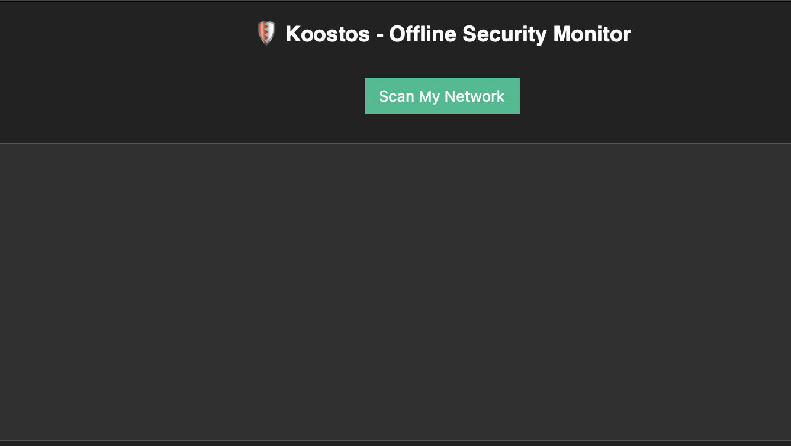
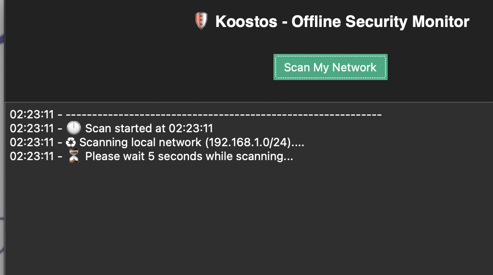
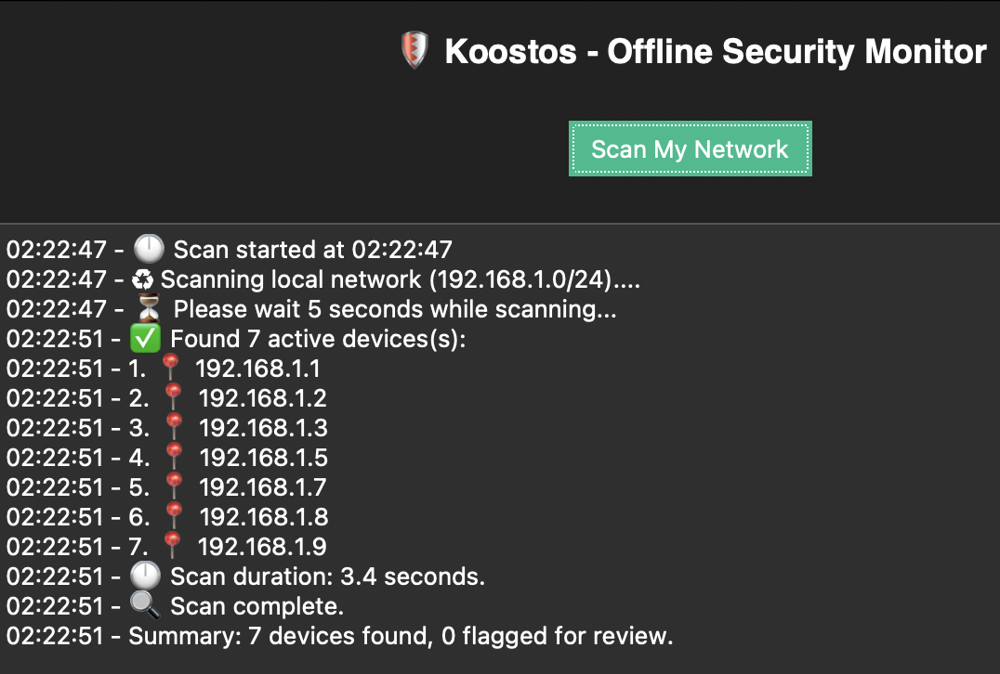

# 🛡️ Koostos – Offline Security Monitor

**Koostos** is a lightweight, offline network scan utility that detects active devices on your local network. It’s built for simplicity; just click and scan.

## 🚀 Features

- Scans the `192.168.1.0/24` local network range
- Detects active IPs
- Flags suspicious IPs using simple logic
- Displays results in a clean GUI
- Works offline, no internet required
- Saves logs to `koostos_scan_log.txt`

### 🖼️ Example Output

## 📥 Download

The zipped `.app` is hosted under the [Releases tab](https://github.com/EduardoPolanco/koostos/releases).

> ⚠️ **Important for macOS Users**  
> macOS may block the app the first time you open it.  
> To allow it:
>
> 1. Right-click the `.app` file and choose **Open**.  
> 2. A warning will appear — click **Open** again.  
> 3. That’s it. It’s now allowed.

This is a standard Gatekeeper security step for apps not from the App Store. No Terminal commands are needed.

## 🧑‍💻 Author & Usage

- **Made by Eduardo Polanco**
- This project is for **educational and personal use only**
- If you share or remix it, **credit the original author**
- **Not intended for resale or monetization**

## 🗑️ Temporary Utility Notice

Koostos was built as a personal offline utility; ideal for quick, one time scans of your local network.

If no anomalies are found, feel free to delete the app. It's not meant to be a long term install or ongoing monitoring tool.

## 🔒 Disclaimer

Koostos is provided “as is” with no warranties or guarantees.  
It’s a basic tool built for local educational purposes. Use responsibly.
